# Fernando_Markdown
## Practica Markdown 2

***

Pasos 

1. Creamos un repositorio remoto en Github

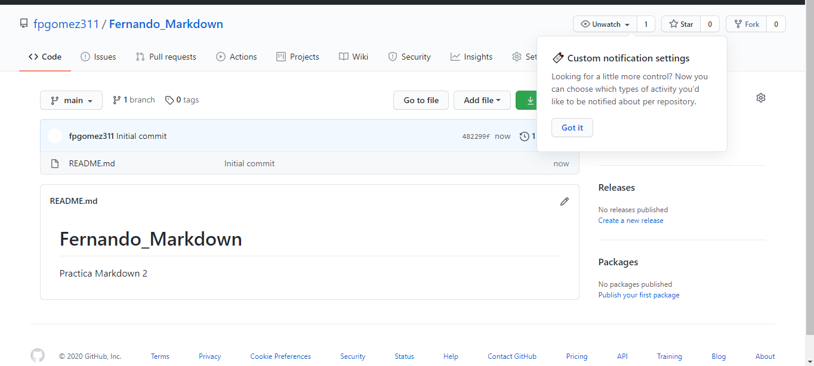

2. Clonamos el repositorio a local

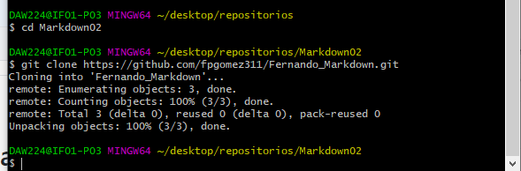

3. Este es nuestro readme

4. Realizamos nuestro primer add, commit y push

Añadimos nuestras imagenes y READ.md con git add
Verificamos que esta  los archivos están listos para commit
Realizamos el commit.

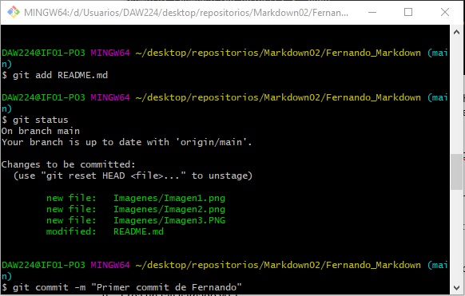

Finalmente hacemos el push

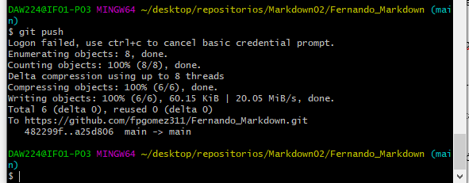

5. Creamos la capeta privada y el archivo de texto privado.txt (dentro de una carpeta .gitignore)

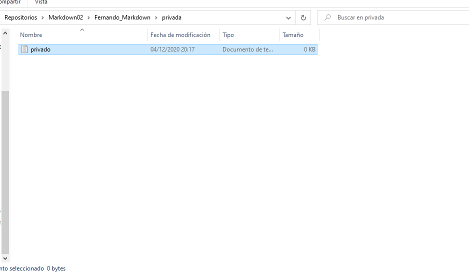

6. Ignoramos la carpeta privada

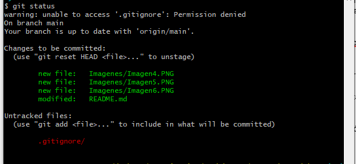

7. Creamos el tag, realizamos git add a fernando.md

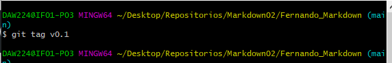
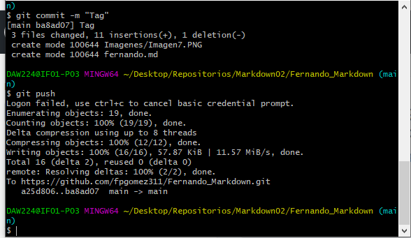

8. Tabla 

Nombre | Repositorio
-- | --
Fernando | https://github.com/fpgomez311/Fernando_Markdown
Fernando | https://github.com/fpgomez311/Fernando_Markdown

***

Práctica 3

1. Creación de ramas

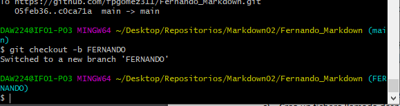

2. Añade un archivo y crea la rama remota

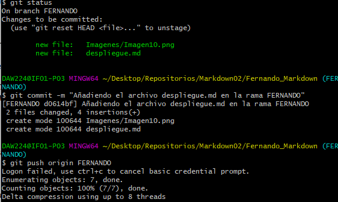

3. Haz un merge directo

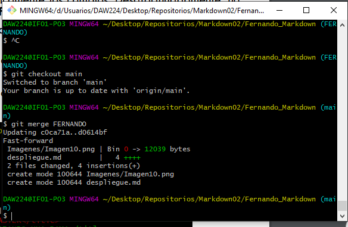

4. Haz un merge con conflicto

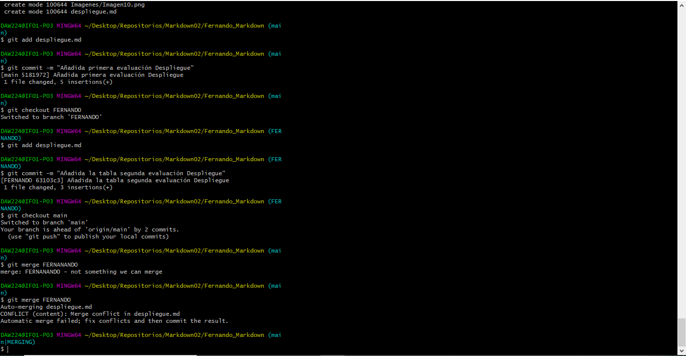

5. Arreglo del conflicto

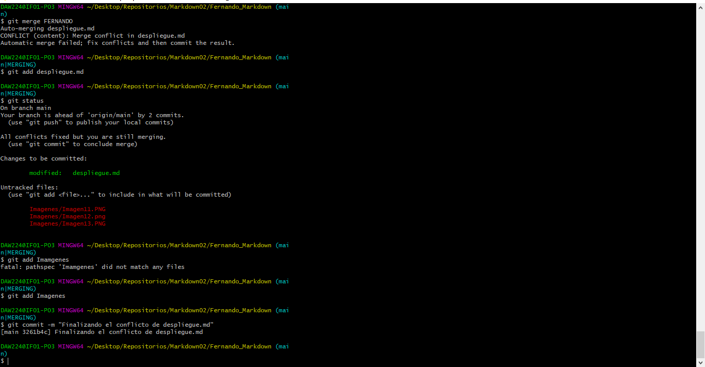

6. Tag y borrar la rama

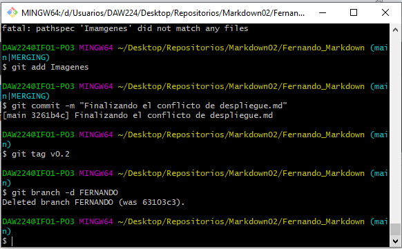

